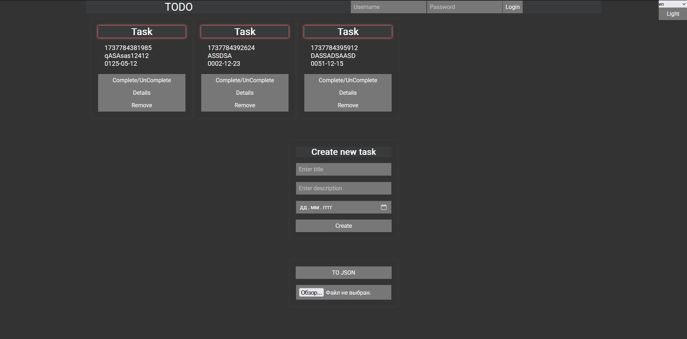

# TODO project 

## STACK: REACT, REDUX, TS



# Project Structure
```
src/
├── app/
│   ├── store.ts          // Setting up the Redux Toolkit Store
│   ├── hooks.ts          // Custom hooks for working with Redux (useAppDispatch, useAppSelector)
│   
├── assets/
│   ├── fonts/          
│   │   ├── Roboto-Regular.ttf  
│   
├── features/
│   ├── tasks/
│   │   ├── tasksSlice.ts // Slice for tasks (CRUD operations)
│   │   ├── types.ts      // Data types for tasks
│   │   ├── components/
│   │   │   ├── TaskItem.tsx  // Component for displaying a single task
│   │   │   ├── TaskList.tsx  // Component for the list of tasks
│   │   │   ├── TaskForm.tsx  // Form for adding/editing a task
│   │   │   ├── ExportTasks.tsx // Component for exporting tasks to JSON
│   │   ├── pages/
│   │   │   ├── TasksPage.tsx // Page with the list of tasks
│   │   │   ├── TaskDetailsPage.tsx // Page with task details
│   │   ├── utils/
│   │       ├── taskHelpers.ts // Helper functions for tasks
│   
│   ├── user/
│   │   ├── userSlice.ts   // Slice for user profile
│   │   ├── types.ts       // Data types for user
│   │   ├── pages/
│   │   │   ├── ProfilePage.tsx // User profile page
│   │
│   ├── settings/
│   │   ├── settingsSlice.ts // Slice for settings (theme, localization)
│   │   ├── types.ts         // Data types for settings
│   │   ├── pages/
│   │       ├── SettingsPage.tsx // Settings page
│   
├── contexts/
│   ├── ThemeContext.tsx   // Theme context
│   ├── LanguageContext.tsx // Language context
│
├── components/
│   ├── Layout/
│   │   ├── Header.tsx      // Application header
│   │   ├── Footer.tsx      // Application footer
│   │   ├── Layout.tsx      // Main layout of the application
│   ├── ThemeSwitcher.tsx   // Theme switcher
│   ├── LanguageSwitcher.tsx // Language switcher
│
├── routes/
│   ├── AppRouter.tsx       // Application routing setup
│   ├── routes.ts           // Route configuration
│
├── styles/
│   ├── global.css          // Global styles
│   ├── theme.ts            // Application themes
│
├── utils/
│   ├── i18n.ts             // Localization setup
│   ├── exportToJson.ts     // Function to export tasks to JSON
│
├── App.tsx                 // Main application component
├── index.tsx               // Entry point of the application
```